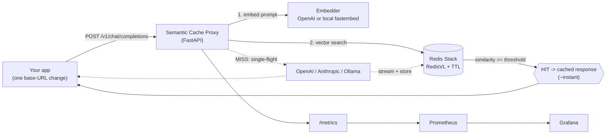

# Semantic LLM Cache

A drop-in middleware proxy that sits between your app and any LLM provider,
detects semantically similar requests, and serves cached responses instantly —
cutting API cost and latency.

It mirrors the OpenAI API, so adopting it means changing one base URL.

> **On a 2,000-request load test: P95 latency 102 ms cached vs 5.7 s uncached (98% reduction), 0 errors, exact-repeat hits 100%, paraphrase recall 93%** — fully local, $0 API cost. ([honest precision caveat below](#load-test-results).)

## Architecture



## See it in 30 seconds

With the proxy running (see [Setup](#setup)), `uv run python scripts/demo.py`:

```text
  [MISS]    3530.9 ms   fresh question
           prompt: What is the capital of France?
           answer: The capital of France is Paris.

  [HIT ]      20.8 ms   exact repeat
           answer: The capital of France is Paris.

  [HIT ]      18.6 ms   paraphrase - different words, same meaning
           prompt: Can you tell me France's capital city?
           answer: The capital of France is Paris.        <- 190x faster, different wording

  [MISS]     846.7 ms   unrelated question
           prompt: Write a one-line haiku about the ocean.
```

A differently-worded question gets the cached answer; an unrelated one correctly misses.

## Why I built it

Every company running LLMs at scale pays for the same questions over and over, and
plain caching can't help — *"What's the capital of France?"* and *"France's capital
city?"* are different strings but the same request. This is the infrastructure that
catches that: a drop-in proxy that caches **semantically**, cutting redundant spend
and latency without touching the calling app.

The interesting finding: a naive hit-rate looks great, but a semantic cache can serve
*wrong* answers if the threshold is too loose. I built a precision harness and found
that **pairwise evaluation overstates real precision at scale** — operationally each
prompt is matched against the nearest of hundreds of cached vectors, not one — so the
real lever is the embedding model, not just the threshold. The numbers below are
reported with that caveat, not hidden by it.

## Features

- **Drop-in OpenAI-compatible API** — point any OpenAI client at it by changing one base URL.
- **Semantic caching** — embeds each prompt and serves cached answers for *reworded* queries, not just exact matches.
- **Multi-provider routing** — by model name to OpenAI, Anthropic, or local Ollama, with full streaming (SSE).
- **Adaptive cache policy** — per-request similarity thresholds and TTL tiers (from temperature or an explicit profile); creative/high-temperature requests bypass the cache.
- **Single-flight** — collapses concurrent identical misses so only one reaches the provider (cache-stampede prevention).
- **Pluggable embeddings** — OpenAI `text-embedding-3-small`, or on-device `fastembed` for a fully local, $0 setup.
- **Observability** — Prometheus metrics + a provisioned Grafana dashboard.
- **Evaluation tooling** — a precision/recall threshold sweep and a load-test harness with per-query-type breakdown.

## Stack

Python 3.11+ · FastAPI · embeddings: OpenAI `text-embedding-3-small` **or** on-device
`fastembed` (no key/GPU) · Redis Stack (RedisVL) · Prometheus + Grafana · Docker Compose.
Chat providers: OpenAI / Anthropic / **Ollama** (free, local).

## Project structure

```text
app/
  proxy/       FastAPI routes, OpenAI-compatible schemas, SSE streaming, single-flight
  cache/       embedding, vector store (RedisVL), namespace keys, policy, threshold tuner
  providers/   OpenAI / Anthropic / Ollama adapters + model-based routing
  metrics/     Prometheus metrics + near-miss analyzer
loadtest/      workload generator + async load runner
eval/          labeled dataset + precision/recall sweep
monitoring/    Prometheus + Grafana provisioning
tests/         unit + Redis integration + async concurrency
```

## Load test results

`uv run python -m loadtest.run --n 2000` against a documented 40/30/30
(exact / paraphrase / unique) workload. Run **fully local** (on-device `bge-small`
embeddings + Ollama `llama3.2:3b`, laptop CPU, 0 API cost):

| Metric | Result |
|---|---|
| Requests / errors | 2,000 / 0 |
| P95 latency — cached vs uncached | **102 ms vs 5.7 s (98% reduction)** |
| Exact-repeat hits | 803 / 803 (100%) |
| Paraphrase recall (true semantic hits) | 559 / 600 (93%) |
| Unique false-hit rate @ 0.85 | 413 / 597 (**69%**) |

**Honest precision finding.** The latency win is real, but at the 0.85 threshold the
local `bge-small` model can't separate true paraphrases from structurally-similar but
distinct prompts. The pairwise `eval/precision.py` sweep reports precision 1.0 at 0.85 —
yet operationally each prompt is matched against the *nearest of hundreds* of stored
vectors, so the real false-hit rate is 69%. **Pairwise precision overstates operational
precision at index scale.** The lever is the embedding model: OpenAI `text-embedding-3-small`
separates these cleanly; thresholds are configurable per backend (`THRESHOLD_BALANCED`).
The harness exists so this is a data-driven call, not a guess.

```bash
uv sync --group local                                 # on-device embeddings, no key
EMBEDDING_BACKEND=local uv run python -m eval.precision        # precision/recall sweep
EMBEDDING_BACKEND=local THRESHOLD_BALANCED=0.85 uv run uvicorn app.main:app  # serve
uv run python -m loadtest.run --n 2000                # load test → loadtest/results.json
```

## Proxy usage

Point any OpenAI client at the proxy by changing the base URL:

```python
from openai import OpenAI
client = OpenAI(base_url="http://localhost:8000/v1", api_key="not-needed-for-ollama")
client.chat.completions.create(
    model="llama3.2:3b",                     # → Ollama (local). gpt-* → OpenAI, claude-* → Anthropic
    messages=[{"role": "user", "content": "hello"}],
)
```

The response carries `X-Cache: HIT|MISS|BYPASS` and `X-Cache-Profile` headers.
Streaming (`stream=True`) is supported on every path — cache hits replay
instantly, misses stream live while buffering the full response to store.

### Cache policy (per request)

A policy picks the similarity threshold and TTL from temperature, or from an
explicit `cache_profile`:

| Profile | Threshold | TTL tier | Inferred when |
|---------|-----------|----------|---------------|
| `relaxed` | 0.90 | long | `temperature ≤ 0.3` (deterministic) |
| `balanced` | 0.95 | default | otherwise |
| `strict` | 0.98 | short | — (explicit only) |
| `off` | — | — | `temperature ≥ 0.8` (creative) → not cached |

Override per request with `"cache_profile": "strict"` and/or `"cache_ttl": 600`.
Concurrent identical misses are collapsed by a single-flight lock so only one
hits the provider.

### Monitoring

`GET /metrics` exposes Prometheus series: `semantic_cache_requests_total{result}`,
`semantic_cache_request_latency_seconds` (cached vs uncached), `semantic_cache_similarity`,
`semantic_cache_cost_saved_usd_total`, and `semantic_cache_near_miss_total`. Prometheus
scrapes it automatically and a Grafana dashboard (hit rate, P50/P95 latency by result,
cost saved, similarity distribution, near-misses) is provisioned at **localhost:3000**.

`GET /admin/near-misses` returns recent lookups that missed but landed just below
the threshold — the near-miss analyzer that tells you whether to loosen it.

### Threshold tuning

`POST /admin/threshold-tuner` with labeled pairs returns the hit-rate vs
**precision** tradeoff across thresholds (and the F1-recommended threshold):

```bash
curl -s localhost:8000/admin/threshold-tuner -H 'Content-Type: application/json' -d '{
  "pairs": [
    {"query": "what is the capital of France", "candidate": "France capital city", "should_hit": true},
    {"query": "what is the capital of France", "candidate": "weather in Paris",        "should_hit": false}
  ]
}'
```

## Setup

```bash
# 1. Configure secrets (never commit .env)
cp .env.example .env
#    then edit .env and add your OWN OpenAI / Anthropic keys

# 2. Install dependencies
uv sync

# 3. Start the infra (Redis Stack + Prometheus + Grafana)
docker-compose up -d redis prometheus grafana

# 4. Run the API locally
uv run uvicorn app.main:app --reload
#    GET http://localhost:8000/health        -> {"status":"ok"}
#    GET http://localhost:8000/health/ready   -> {"status":"ready"}  (needs Redis)
```

## Tests

```bash
docker-compose up -d redis      # integration tests need Redis Stack
uv run pytest                   # unit tests run without it; integration tests skip if absent
```

## Latency benchmark

```bash
uv run python scripts/bench_overhead.py   # per-request embed + vector-search overhead
```

## Security

- Secrets live only in `.env` (git-ignored). Never commit keys, never paste them anywhere.
- The proxy never logs prompt contents by default.

## Ports

| Service | URL |
|---------|-----|
| API | http://localhost:8000 |
| RedisInsight | http://localhost:8001 |
| Prometheus | http://localhost:9090 |
| Grafana | http://localhost:3000 (set `GRAFANA_ADMIN_PASSWORD` in `.env`) |
